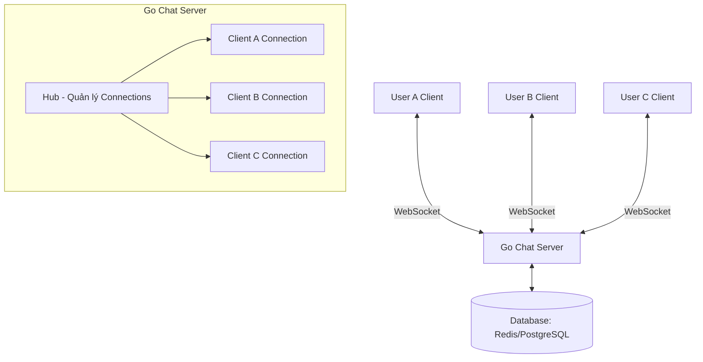
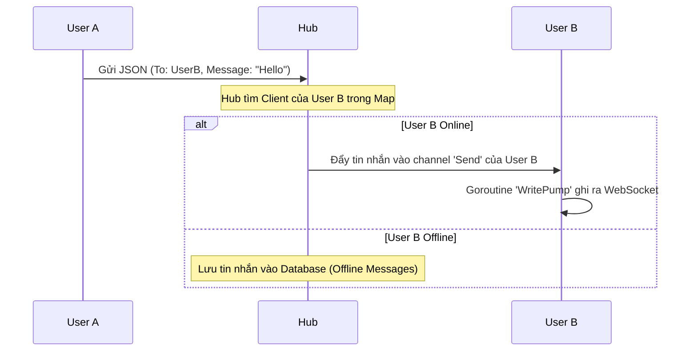
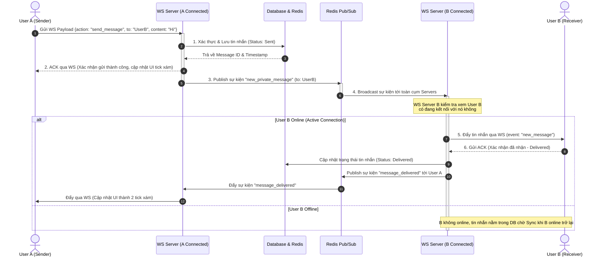
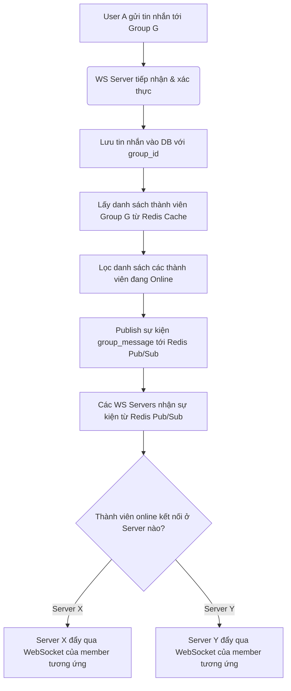
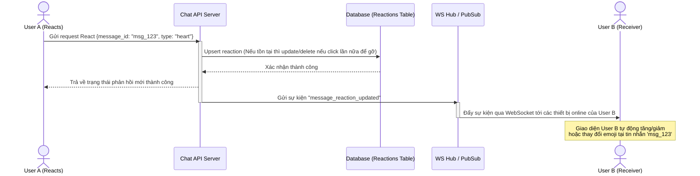
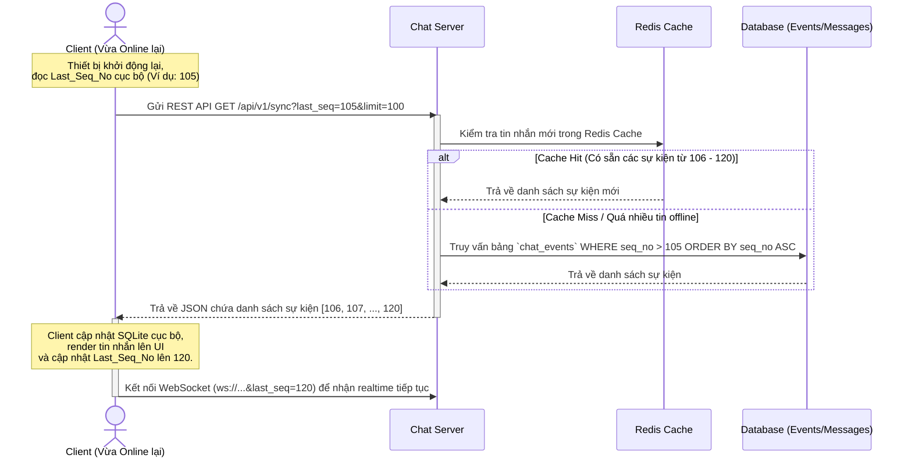

# Thiết kế Hệ thống Chat App Realtime bằng Go & WebSocket

Tài liệu này mô tả kiến trúc và thiết kế chi tiết cho một hệ thống chat realtime sử dụng Golang và WebSocket, phục vụ mục đích nhắn tin trực tiếp giữa các người dùng (User-to-User).

## 1. Tổng quan Kiến trúc (Architecture Overview)

Hệ thống sẽ sử dụng mô hình **Hub & Spoke** phổ biến trong việc quản lý kết nối WebSocket ở Golang.



## 2. Các Thành phần Chính (Core Components)

### 2.1. Client (Trình duyệt / Mobile App)

- Mở kết nối WebSocket (`ws://` hoặc `wss://`) tới server.
- Lắng nghe sự kiện để hiển thị tin nhắn.
- Gửi và nhận tin nhắn dưới định dạng JSON.

### 2.2. Server (Golang)

Sử dụng thư viện `github.com/gorilla/websocket` để xử lý kết nối.
Các thực thể chính trong code sẽ bao gồm:

- **Client Struct:** Đại diện cho một kết nối WebSocket của một user.
  - Chứa thông tin: `UserID`, con trỏ tới `Hub`, `Conn` (WebSocket connection), và một buffered channel `Send` để đẩy tin nhắn xuống client này.
  - Có 2 goroutines chạy ngầm cho mỗi client: `ReadPump` (chờ đọc tin nhắn từ user gửi lên) và `WritePump` (đợi có tin nhắn trong channel `Send` để ghi xuống kết nối WebSocket).
- **Hub Struct:** Trung tâm điều phối, quản lý tất cả các `Client` đang active.
  - `Clients`: Một map lưu trữ các client đang kết nối. Để hỗ trợ chat 1-1, key của map nên là `UserID`.
  - `Register`: Channel để đăng ký client mới khi họ kết nối.
  - `Unregister`: Channel để hủy đăng ký client khi họ ngắt kết nối hoặc mất mạng.
  - `PrivateMessage`: Channel để nhận tin nhắn gửi 1-1 và định tuyến đến đúng `UserID`.

## 3. Luồng Hoạt động (Data Flow)

### 3.1. Kết nối & Xác thực (Connection & Authentication)

1. User gọi API HTTP login thông thường để lấy JWT token.
2. User mở kết nối WebSocket: `ws://domain/ws?token=<jwt_token>`.
3. Server verify token, trích xuất ra `UserID`.
4. Nếu hợp lệ, Server upgrade HTTP connection lên WebSocket connection.
5. Server tạo một object `Client`, gán `UserID`, và đẩy vào channel `Hub.Register`. Hub sẽ lưu client này vào map.

### 3.2. Gửi và Nhận tin nhắn (Messaging Flow)



## 4. Cấu trúc Thư mục Đề xuất (Folder Structure)

Phù hợp với project Golang hiện tại của bạn:

```text
go-app/
├── cmd/
│   └── api/
│       └── main.go           # Khởi tạo Server, Hub và các Router
├── internal/
│   ├── chat/                 # Domain logic cho WebSocket Chat
│   │   ├── client.go         # Định nghĩa Client, ReadPump, WritePump
│   │   ├── hub.go            # Định nghĩa Hub, Run(), Đăng ký/Hủy Client
│   │   └── message.go        # Định nghĩa các struct Payload JSON cho tin nhắn
│   ├── handler/
│   │   └── websocket.go      # HTTP handler (ví dụ: /ws) để Upgrade Connection
│   ├── middleware/
│   │   └── auth.go           # Middleware xác thực JWT (cho HTTP và WS)
│   └── model/
│       └── user.model.go     # Model người dùng (hiện tại của bạn)
├── pkg/
│   └── util/
├── go.mod
└── go.sum
```

## 5. Quy trình Nghiệp vụ Chi tiết (Detailed Business Workflows)

Phần này mô tả chi tiết các quy trình nghiệp vụ cốt lõi của hệ thống Chat, đảm bảo tính realtime, nhất quán dữ liệu và trải nghiệm người dùng tối ưu.

### 5.1. Luồng Gửi Tin nhắn: Direct Chat (1-1) & Group Chat (1-N)

Để đảm bảo tin nhắn không bị thất lạc và được lưu trữ an toàn trước khi phân phối, hệ thống áp dụng cơ chế **Lưu trước - Đẩy sau (Store and Forward)** kết hợp với **Message Queue / Redis Pub-Sub** để mở rộng quy mô.

#### A. Luồng Nhắn tin Trực tiếp (Direct Chat 1-1)



> [!TIP]
> **Tối ưu hóa:** Thay vì gửi tin nhắn trực tiếp qua WebSocket rồi chờ lưu DB, việc gửi qua REST API HTTP POST `/api/v1/messages` để lưu vào DB trước cũng là một giải pháp rất phổ biến và an toàn, giúp dễ dàng xử lý file đính kèm lớn (image, video) thông qua multipart form-data. WebSocket khi đó chỉ tập trung vào việc truyền phát sự kiện realtime.

#### B. Luồng Nhắn tin Nhóm (Group Chat 1-N)

Trong Group Chat, danh sách thành viên của group có thể rất lớn. Để tránh việc truy vấn cơ sở dữ liệu liên tục gây nghẽn cổ chai:

1. Danh sách `Group Members` được cache trong **Redis Set** (key: `group:members:<group_id>`).
2. Trạng thái Online của các user được quản lý tập trung trong Redis (key: `user:online_status`).



---

### 5.2. Luồng Thu hồi (Delete) & Thả cảm xúc (React) Tin nhắn

Các hành động thu hồi tin nhắn hoặc thả cảm xúc thực chất là **Sự kiện Cập nhật Trạng thái Tin nhắn (Message State Update Events)**.

#### A. Thu hồi tin nhắn (Delete/Recall Message)

Hệ thống không thực hiện xóa vật lý (Hard Delete) bản ghi tin nhắn ngay lập tức trong Database để tránh phá vỡ tính nhất quán của lịch sử trò chuyện và phục vụ tính năng báo cáo/audit nếu cần. Hệ thống áp dụng **Soft Delete**:

1. Cập nhật trường `is_deleted = true` trong collection `messages` trong database.
2. Thay đổi thành `"Tin nhắn đã bị thu hồi"`.
3. Server broadcast sự kiện thu hồi qua WebSocket tới toàn bộ thành viên trong cuộc hội thoại kèm theo `message_id`.
4. Client nhận sự kiện, tìm tin nhắn tương ứng theo `message_id` trên bộ nhớ cục bộ (Local Storage/SQLite) và cập nhật giao diện hiển thị thành _"Tin nhắn đã bị thu hồi"_.

#### B. Thả cảm xúc tin nhắn (React Message)

Để quản lý cảm xúc, chúng ta thiết kế một bảng riêng `message_reactions` liên kết 1-N với bảng `messages`.

**Database Schema đề xuất cho Reactions:**

- `message_id` (UUID, Foreign Key)
- `type_of_reaction` (String, ví dụ: "like", "heart", "laugh", "sad")
- `created_by` (UUID, Foreign Key)
- `created_at` (Timestamp)

**Quy trình xử lý:**



---

### 5.3. Cơ chế Đồng bộ Tin nhắn trên Nhiều Thiết bị (Multi-Device Synchronization)

Khi một người dùng đăng nhập đồng thời trên nhiều thiết bị (Web, Desktop, Mobile), việc đảm bảo tin nhắn hiển thị đồng nhất và không bị lệch pha là vô cùng quan trọng.

#### A. Thiết kế Kết nối (1 User -> N Connections)

Để hỗ trợ multi-device, kiến trúc **Hub** ở máy chủ Golang phải thay đổi cấu trúc quản lý kết nối:

- Thay vì sử dụng map: `clients map[string]*Client` (với key là `user_id`).
- Ta chuyển sang map: `clients map[string]map[string]*Client` (key 1 là `user_id`, key 2 là `device_id` hoặc `connection_id`).

Khi có tin nhắn mới gửi đến `User B`, server sẽ duyệt qua danh sách các kết nối active của `User B` trên mọi thiết bị và đẩy tin nhắn xuống từng thiết bị đó. Đồng thời, tin nhắn cũng được đẩy ngược lại các thiết bị khác của chính người gửi `User A` để đồng bộ hóa đầu gửi.

#### B. Cơ chế Đồng bộ hóa khi Offline-to-Online (Sync Token / Sequence Number)

Khi một thiết bị bị ngắt kết nối (mất mạng, đóng app) rồi online trở lại, nó đã bỏ lỡ các sự kiện realtime qua WebSocket. Để đồng bộ lại lịch sử tin nhắn một cách chính xác mà không cần tải lại toàn bộ hộp thư:

##### Giải pháp: Sử dụng **Sequence Number (Số tuần tự tăng dần)** và **Version (kiểm tra version ở thiết bị nếu như thấp hơn thì sẽ gọi request để lấy)**.

Mỗi khi có bất kỳ sự kiện nào xảy ra trong một cuộc trò chuyện (Tin nhắn mới, Thu hồi, Thả cảm xúc), Server sẽ lưu sự kiện đó vào một bảng nhật ký thay đổi (`chat_events`) và sinh ra một **Sequence Number (SeqNo)** tăng dần liên tục cho cuộc trò chuyện hoặc người dùng đó.



---

## 6. Thiết kế Payload (JSON Structure)

Khi Client (Người gửi) gửi tin nhắn lên Server:

```json
{
  "action": "send_message",
  "to_user_id": "uuid-cua-nguoi-nhan",
  "content": "Chào bạn, đây là tin nhắn realtime!"
}
```

Khi Server định tuyến và gửi tin nhắn xuống Client (Người nhận):

```json
{
  "event": "new_message",
  "data": {
    "from_user_id": "uuid-cua-nguoi-gui",
    "content": "Chào bạn, đây là tin nhắn realtime!",
    "timestamp": 1698765432
  }
}
```

## 7. Mở rộng trong tương lai (Scalability - Khi có nhiều người dùng)

Kiến trúc trên hoạt động rất tốt trên **1 Server duy nhất**. Tuy nhiên, nếu bạn chạy ứng dụng trên nhiều server (Multi-instances / Kubernetes):

- Cần sử dụng **Redis Pub/Sub** hoặc **RabbitMQ**.
- **Lý do:** User A kết nối tới Server 1, User B kết nối tới Server 2. Hub ở Server 1 không biết User B.
- **Giải pháp:**
  - Khi User A gửi tin nhắn cho User B, Server 1 sẽ Publish tin nhắn vào Redis channel `chat_messages`.
  - Tất cả các Servers đều Subscribe channel này.
  - Khi Server 2 nhận được thông điệp từ Redis, nó kiểm tra xem User B có đang kết nối với nó không, nếu có thì sẽ gửi qua WebSocket cho User B.
