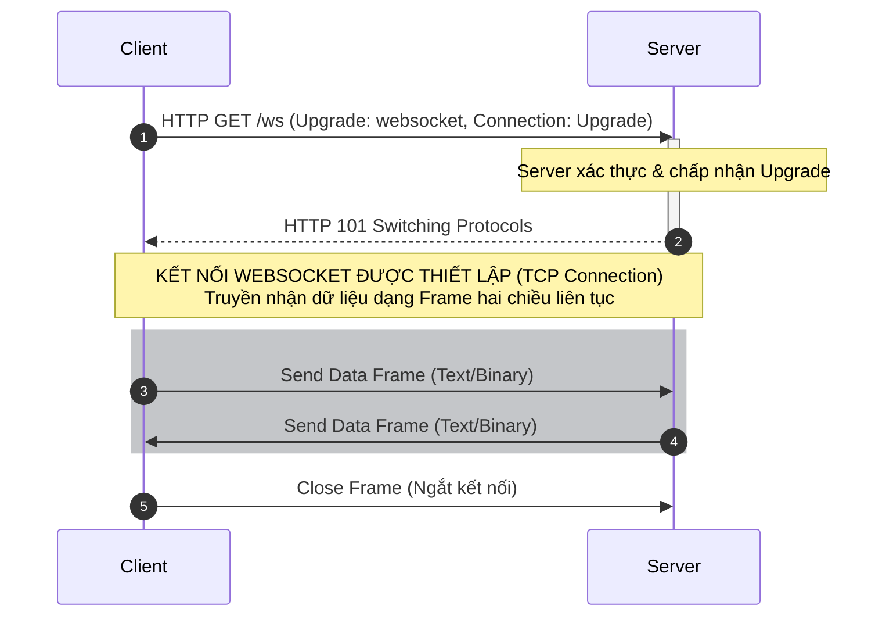
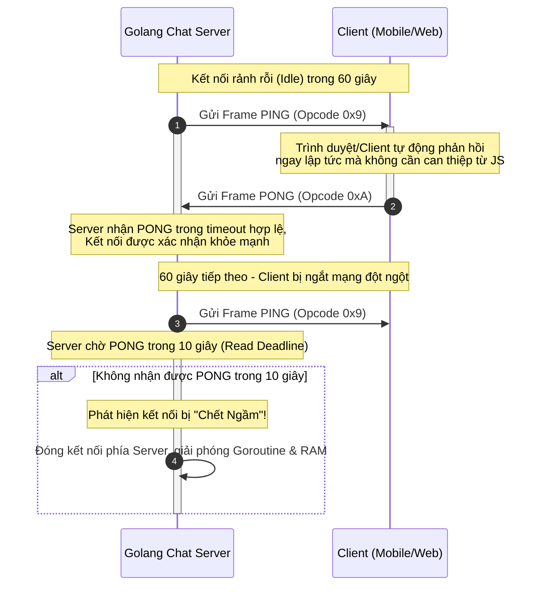
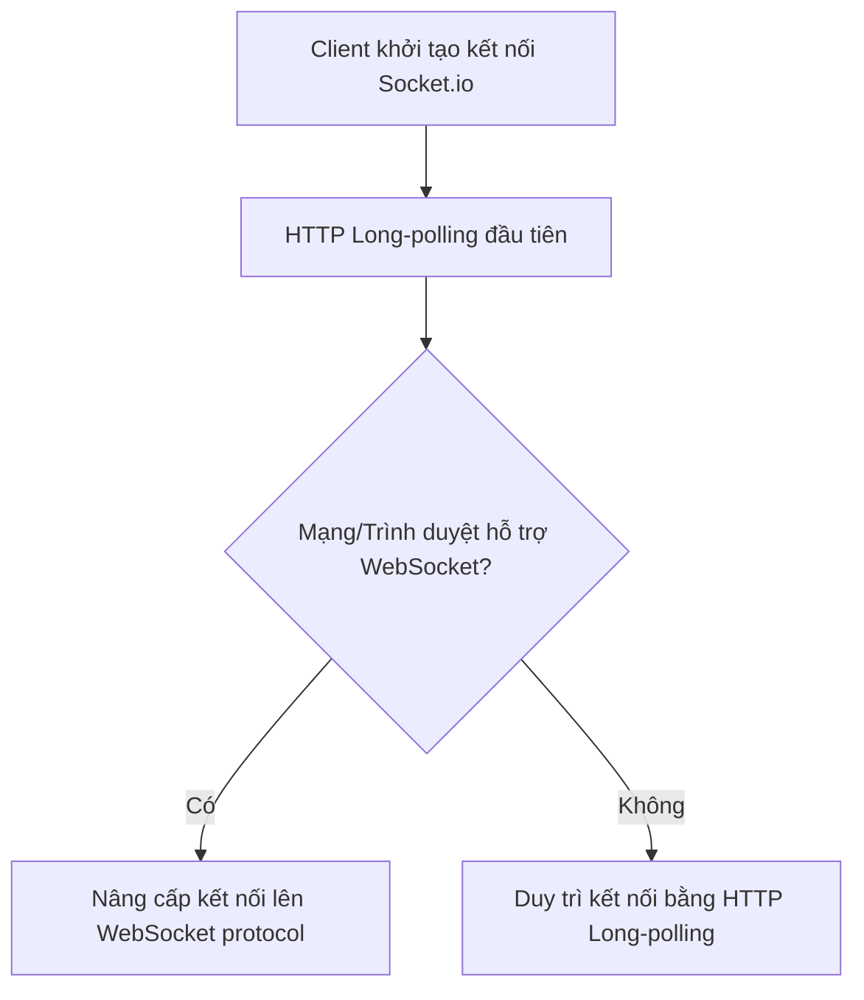

# Tìm hiểu về WebSocket Thuần (Raw WebSocket) & So sánh với Socket.io

Tài liệu này cung cấp cái nhìn chi tiết về giao thức **WebSocket thuần (Raw WebSocket)**, nguyên lý hoạt động, và so sánh chuyên sâu với giải pháp **Socket.io** phổ biến trong các ứng dụng realtime.

---

## 1. WebSocket Thuần (Raw WebSocket) là gì?

**WebSocket** là một giao thức truyền thông hai chiều (full-duplex), song song toàn phần qua một kết nối **TCP** duy nhất, được chuẩn hóa bởi IETF trong **RFC 6455** và được hỗ trợ sẵn trên hầu hết các trình duyệt hiện đại thông qua Web IDL `WebSocket` API.



---

### 1.1. Chi tiết Quá trình Handshake (Bắt tay HTTP Upgrade)

Mặc dù WebSocket hoạt động trên một giao thức truyền tin hoàn toàn riêng biệt sau khi được thiết lập, quá trình khởi tạo kết nối bắt buộc phải đi qua một lượt **Handshake HTTP** để tận dụng hạ tầng HTTP hiện tại (port 80/443), giúp dễ dàng đi qua các proxy và tường lửa.

#### A. Request của Client (HTTP GET Upgrade)

Khi khởi tạo kết nối, Client gửi một request **HTTP với method GET** chuẩn hóa kèm theo các Header bắt buộc:

```http
GET /websocket HTTP/1.1
Host: server.example.com
Upgrade: websocket
Connection: Upgrade
Sec-WebSocket-Key: dGhlIHNhbXBsZSBub25jZQ==
Sec-WebSocket-Version: 13
Origin: http://example.com
```

- `Upgrade: websocket` & `Connection: Upgrade`: Yêu cầu máy chủ nâng cấp giao thức từ HTTP/1.1 lên WebSocket.
- `Sec-WebSocket-Key`: Một chuỗi ngẫu nhiên 16-byte được mã hóa Base64 dùng để kiểm chứng tính tương thích và bảo mật của Server (tránh việc Server phản hồi nhầm từ bộ nhớ cache HTTP).
- `Sec-WebSocket-Version`: Phiên bản giao thức WebSocket được sử dụng (phổ biến nhất hiện nay là bản 13).
- `Origin`: Ngăn chặn tấn công **Cross-Site WebSocket Hijacking (CSWSH)** bằng cách kiểm tra nguồn gốc của script tạo kết nối.

#### B. Phản hồi của Server (HTTP 101 Switching Protocols)

Nếu Server đồng ý nâng cấp kết nối, nó sẽ phản hồi bằng mã trạng thái `101`:

```http
HTTP/1.1 101 Switching Protocols
Upgrade: websocket
Connection: Upgrade
Sec-WebSocket-Accept: s3pPLMBiTxaQ9kYGzzhZRbK+xOo=
```

#### C. Công thức mã hóa Cryptographic của `Sec-WebSocket-Accept`

Để chứng minh Server thực sự hiểu giao thức WebSocket và không phải là một proxy trung gian đang cache lại response HTTP thông thường, Server phải thực hiện tính toán chuỗi xác minh `Sec-WebSocket-Accept` dựa trên thuật toán sau:

1. Lấy giá trị của `Sec-WebSocket-Key` từ Client gửi lên (ví dụ: `dGhlIHNhbXBsZSBub25jZQ==`).
2. Nối chuỗi này với một **Magic String UUID** chuẩn hóa cố định toàn cầu: `"258EAFA5-E914-47DA-95CA-C5AB0DC85B11"`.
   - Chuỗi ghép: `dGhlIHNhbXBsZSBub25jZQ==258EAFA5-E914-47DA-95CA-C5AB0DC85B11`
3. Tính mã băm **SHA-1** của chuỗi ghép trên (kết quả ở dạng nhị phân binary 20-byte).
4. Mã hóa **Base64** kết quả nhị phân SHA-1 đó để tạo ra chuỗi hash cuối cùng.

```
Ví dụ:
Sec-WebSocket-Key:    "dGhlIHNhbXBsZSBub25jZQ=="
Magic String UUID:    "258EAFA5-E914-47DA-95CA-C5AB0DC85B11"
Nối chuỗi:            "dGhlIHNhbXBsZSBub25jZQ==258EAFA5-E914-47DA-95CA-C5AB0DC85B11"
SHA-1 Hash (Hex):     b37a4f2cc0624f1690f64606cf385945b2bec4ea
Base64 Encode:        "s3pPLMBiTxaQ9kYGzzhZRbK+xOo="  <-- Khớp chính xác Sec-WebSocket-Accept
```

---

### 1.2. Cấu trúc nhị phân của WebSocket Frame (RFC 6455 Section 5.2)

Khác với HTTP truyền tải dưới dạng văn bản thuần thô ráp, WebSocket phân mảnh dữ liệu truyền đi thành các đơn vị nhị phân cực nhỏ gọi là **Frame (Khung truyền tin)**. Việc hiểu rõ cấu trúc byte/bit của Frame là chìa khóa để tối ưu hiệu năng.

Dưới đây là sơ đồ cấu trúc bit của một WebSocket Frame tiêu chuẩn:

```text
 0                   1                   2                   3
 0 1 2 3 4 5 6 7 8 9 0 1 2 3 4 5 6 7 8 9 0 1 2 3 4 5 6 7 8 9 0 1
+-+-+-+-+-------+-+-------------+-------------------------------+
|F|R|R|R| opcode|M| Payload len |    Extended payload length    |
|I|S|S|S|  (4b) |A|     (7b)    |             (16/64)           |
|N|V|V|V|       |S|             |   (if payload len==126/127)   |
| |1|2|3|       |K|             |                               |
+-+-+-+-+-------+-+-------------+-------------------------------+
|     Extended payload length continued, if payload len == 127  |
+-------------------------------+-------------------------------+
|                               |Masking-key, if MASK set to 1  |
+-------------------------------+-------------------------------+
| Masking-key (continued)       |          Payload Data         |
+-------------------------------- - - - - - - - - - - - - - - - +
:                     Payload Data continued ...                :
+---------------------------------------------------------------+
```

#### Phân tích chi tiết từng Bit-field:

1. **FIN (1 bit):** Viết tắt của _Final_. Nếu bằng `1`, đây là frame cuối cùng của tin nhắn đó. Nếu bằng `0`, tin nhắn chưa kết thúc và sẽ có các frame tiếp theo (hỗ trợ truyền phát streaming dữ liệu cực lớn).
2. **RSV1, RSV2, RSV3 (1 bit mỗi trường):** Được dành riêng cho các extension mở rộng trong tương lai (ví dụ: thuật toán nén dữ liệu `permessage-deflate`). Bình thường các bit này bằng `0`.
3. **Opcode (4 bits):** Định nghĩa kiểu dữ liệu của Frame:
   - `0x0`: Continuation Frame (Khung nối tiếp của tin nhắn phân mảnh trước đó).
   - `0x1`: Text Frame (Dữ liệu dạng văn bản mã hóa UTF-8).
   - `0x2`: Binary Frame (Dữ liệu nhị phân thô, dùng cho file, audio, video).
   - `0x8`: Connection Close (Yêu cầu ngắt kết nối).
   - `0x9`: Ping (Hỏi trạng thái hoạt động - Control Frame).
   - `0xA`: Pong (Trả lời trạng thái hoạt động - Control Frame).
4. **MASK (1 bit):** Định nghĩa xem dữ liệu Payload có được che giấu (mã hóa XOR) hay không.
   - **BẮT BUỘC:** Toàn bộ Frame được gửi từ **Client lên Server bắt buộc phải MASK = 1** và chứa một khóa 4-byte (`Masking-key`). Nếu Client gửi frame không che giấu (Mask = 0), Server buộc phải ngắt kết nối lập tức vì lý do bảo mật.
   - **BẮT BUỘC:** Các Frame gửi từ **Server xuống Client bắt buộc phải MASK = 0** (không được phép che giấu).
5. **Payload Length (7 bits, hoặc 7 + 16 bits, hoặc 7 + 64 bits):** Định nghĩa độ dài của Payload:
   - Nếu kích thước dữ liệu $\le 125$ bytes: Trường này lưu trực tiếp giá trị đó.
   - Nếu kích thước dữ liệu từ $126$ đến $65535$ bytes: Giá trị của 7-bit này sẽ là `126` ($0x7E$), và 16-bit tiếp theo (Extended Payload Length) sẽ lưu độ dài thực tế của dữ liệu.
   - Nếu kích thước dữ liệu $> 65535$ bytes: Giá trị của 7-bit này sẽ là `127` ($0x7F$), và 64-bit tiếp theo (8 bytes) sẽ lưu độ dài thực tế của dữ liệu.
6. **Masking-key (0 hoặc 4 bytes):** Nếu bit MASK = 1, đây là chuỗi khóa 4-byte ngẫu nhiên do Client sinh ra để thực hiện phép toán XOR mã hóa payload.

---

### 1.3. Cơ chế Masking XOR phía Client & Bảo mật Proxy

Một câu hỏi kinh điển khi học WebSocket thuần: **Tại sao Client bắt buộc phải che giấu (mask) tin nhắn gửi lên Server, trong khi Server thì không cần?**

#### A. Lý do Bảo mật: Ngăn chặn tấn công Cache Poisoning (Đầu độc bộ nhớ đệm)

Nếu Client gửi dữ liệu thô (không che giấu), một script độc hại chạy trên trình duyệt có thể giả lập một HTTP request tinh vi nhúng trong một frame nhị phân WebSocket. Khi đi qua các proxy trung gian kém thông minh (những HTTP proxy không thực sự hiểu giao thức WebSocket mà chỉ chuyển tiếp mù quáng), proxy này có thể nhầm tưởng đó là một HTTP request chuẩn và thực hiện cache lại phản hồi sai lệch từ Server. Điều này có thể dẫn đến việc đầu độc bộ nhớ đệm (Cache Poisoning), gây mất an toàn cho toàn bộ hệ thống mạng nội bộ.

Bằng cách áp dụng **Masking**, toàn bộ dữ liệu đi qua đường truyền mạng được trộn lẫn ngẫu nhiên liên tục. Các proxy trung gian chỉ nhìn thấy các byte vô nghĩa và không thể diễn dịch nhầm thành các gói tin HTTP chuẩn.

#### B. Thuật toán Masking XOR siêu tốc

Thuật toán che giấu hoạt động cực kỳ nhẹ nhàng ở tầng nhị phân để không gây nghẽn hiệu năng.
Với mỗi byte thứ `i` của Payload ban đầu ($D_i$), nó được XOR với byte thứ `i mod 4` của Masking Key ($K$):

$$\text{Masked}_i = D_i \oplus K_{i \pmod 4}$$

Khi Server nhận được Frame từ Client, nó thực hiện phép toán XOR ngược lại để giải mã (do phép XOR có tính đối xứng: $(A \oplus B) \oplus B = A$):

$$D_i = \text{Masked}_i \oplus K_{i \pmod 4}$$

---

### 1.4. Cơ chế Ping/Pong & Quản lý Kết nối "Chết Ngầm" (Half-Open Connection)

Một trong những vấn đề nghiêm trọng nhất của kết nối TCP là **Kết nối Chết Ngầm (Half-Open Connection)**. Hiện tượng này xảy ra khi một bên (ví dụ: điện thoại di động của User đi vào vùng mất sóng, hết pin đột ngột) bị ngắt kết nối mà không kịp gửi gói tin đóng TCP (FIN packet). Đầu bên kia (Server) vẫn đinh ninh kết nối đang hoạt động tốt và lãng phí tài nguyên để duy trì kết nối rác này.

Để giải quyết triệt để, WebSocket cung cấp cơ chế kiểm tra nhịp tim (Heartbeat) ở tầng giao thức bằng **Control Frames** (`Ping` và `Pong`).



#### Cách Golang (thư viện `gorilla/websocket`) xử lý Ping/Pong tối ưu:

Trong Golang, chúng ta thiết lập cơ chế đọc deadline và handler để tự động quản lý vòng đời connection:

```go
// Thiết lập giới hạn thời gian chờ tin nhắn tiếp theo
conn.SetReadDeadline(time.Now().Add(pongWait))

// Đăng ký Callback khi nhận được PONG từ Client
conn.SetPongHandler(func(string) error {
    // Mỗi lần nhận được PONG, ta kéo dài thời gian sống (Read Deadline) thêm một khoảng pongWait
    conn.SetReadDeadline(time.Now().Add(pongWait))
    return nil
})

// Chạy một goroutine ngầm định kỳ gửi PING tới Client
go func() {
    ticker := time.NewTicker(pingPeriod)
    defer ticker.Stop()
    for range ticker.C {
        conn.SetWriteDeadline(time.Now().Add(writeWait))
        if err := conn.WriteMessage(websocket.PingMessage, nil); err != nil {
            return
        }
    }
}()
```

---

### 1.5. Cơ chế Phân mảnh Tin nhắn (Message Fragmentation)

Khi cần gửi một dữ liệu có kích thước cực lớn (ví dụ: một file ảnh 20MB hoặc luồng dữ liệu stream âm thanh liên tục), việc gửi trên một single frame duy nhất sẽ làm tắc nghẽn đường truyền mạng và chiếm dụng bộ nhớ buffer quá mức. WebSocket giải quyết bằng **Fragmentation (Phân mảnh)**:

1. **Frame khởi đầu:** Mang opcode tương ứng (`0x1` cho text hoặc `0x2` cho binary) và bit `FIN = 0` (báo hiệu dữ liệu chưa hết).
2. **Các Frame trung gian:** Mang opcode `0x0` (Continuation Frame) và bit `FIN = 0`.
3. **Frame kết thúc:** Mang opcode `0x0` (Continuation Frame) và bit `FIN = 1` (báo hiệu đã truyền xong toàn bộ tin nhắn).

Client khi nhận được chuỗi frame này sẽ tự động ghép nối lại thành một tin nhắn hoàn chỉnh trước khi đẩy lên tầng ứng dụng của JavaScript (`onmessage`).

---

## 2. Socket.io là gì?

**Socket.io** **không phải** là một WebSocket implementation thuần túy. Nó là một **thư viện/framework JavaScript** hướng sự kiện (event-driven), được xây dựng trên nền tảng của **Engine.io** nhằm cung cấp một lớp trừu tượng (abstraction layer) phục vụ giao tiếp realtime giữa Client và Server.

Một kết nối Socket.io thực tế hoạt động như sau:



### 2.1. Điểm đặc biệt của Socket.io

- **Engine.io:** Lớp bên dưới chịu trách nhiệm thiết lập kết nối, quản lý cơ chế phục hồi kết nối (fallback) và nâng cấp giao thức (upgrade).
- **Bắt đầu bằng HTTP Long-polling:** Thay vì mở kết nối WebSocket ngay lập tức, Socket.io thường mở một request HTTP long-polling trước để đảm bảo tính tương thích (vượt qua các proxy/firewall khó tính chặn cổng WS), sau đó mới nâng cấp lên WebSocket một cách âm thầm nếu khả thi.
- **Định dạng dữ liệu tùy biến:** Socket.io bọc dữ liệu gửi đi trong một định dạng riêng (thường là stringified JSON kèm theo mã sự kiện) nên client thuần WebSocket không thể kết nối trực tiếp đến server Socket.io và ngược lại.

---

## 3. So sánh Chi tiết: WebSocket Thuần vs Socket.io

| Tiêu chí                         | WebSocket Thuần (Raw WebSocket)                                                                                                      | Socket.io                                                                                                                                                        |
| :------------------------------- | :----------------------------------------------------------------------------------------------------------------------------------- | :--------------------------------------------------------------------------------------------------------------------------------------------------------------- |
| **Bản chất**                     | Là một **Giao thức (Protocol)** tiêu chuẩn mạng (RFC 6455).                                                                          | Là một **Thư viện/Framework** phát triển trên nền của WebSocket và HTTP.                                                                                         |
| **Cơ chế Fallback**              | Không có sẵn. Nếu mạng hoặc trình duyệt không hỗ trợ WS, kết nối sẽ thất bại hoàn toàn.                                              | Tự động hạ cấp xuống **HTTP Long-polling** nếu kết nối WebSocket bị chặn hoặc không được hỗ trợ.                                                                 |
| **Tính tương thích đa nền tảng** | **Rất cao.** Mọi ngôn ngữ (Go, Rust, Python, C++, Java...) đều có thư viện chuẩn hỗ trợ RFC 6455. Kết nối được với mọi thiết bị IoT. | **Trung bình.** Chủ yếu mạnh nhất trong hệ sinh thái Node.js/JS. Các ngôn ngữ khác cần thư viện client Socket.io riêng biệt được cập nhật khớp version protocol. |
| **Độ phức tạp & Kích thước**     | Rất nhẹ (Lightweight). Trình duyệt hỗ trợ sẵn API `new WebSocket()`, không cần tải thêm thư viện Client.                             | Nặng hơn do chứa nhiều logic nghiệp vụ. Cần tải thư viện client `socket.io-client` (~10-15KB gzipped).                                                           |
| **Tính năng Tích hợp sẵn**       | Chỉ có truyền/nhận tin nhắn thô, Ping/Pong để giữ kết nối.                                                                           | Hỗ trợ cực mạnh: Auto-reconnect, Packet Buffer (gửi lại khi có mạng), Rooms (nhóm kết nối), Namespaces (chia luồng), Broadcasting...                             |
| **Độ trễ & Hiệu năng**           | **Tối ưu nhất.** Overhead rất nhỏ (chỉ 2-10 bytes cho một frame header).                                                             | Độ trễ cao hơn một chút do có thêm lớp xử lý wrapper và parse JSON của Socket.io.                                                                                |
| **Hệ sinh thái Golang**          | Tuyệt vời. Các thư viện như `gorilla/websocket` hoặc `nhooyr/websocket` rất mạnh mẽ, hiệu năng cao và chuẩn chỉnh.                   | Khá khó khăn. Các thư viện Socket.io Server viết bằng Go thường không được cập nhật kịp so với phiên bản Socket.io (Node.js) chính thức.                         |

---

## 4. Phân tích Sâu về các Tính năng Tự viết vs Ăn liền

Để hiểu rõ sự khác biệt, hãy xem cách chúng ta giải quyết các bài toán thực tế bằng 2 phương án này:

### 4.1. Cơ chế Tự động Kết nối lại (Auto-reconnect)

- **Socket.io:** Tích hợp sẵn hoàn toàn. Nếu mạng bị ngắt, Client Socket.io sẽ tự động thử kết nối lại với thuật toán Exponential Backoff.
- **WebSocket Thuần:** Phải tự viết ở phía Client:
  ```javascript
  function connect() {
    const ws = new WebSocket("ws://localhost:8080/ws");
    ws.onclose = function (e) {
      console.log("Socket closed. Reconnecting in 3 seconds...", e.reason);
      setTimeout(function () {
        connect();
      }, 3000);
    };
  }
  ```

### 4.2. Khái niệm Rooms & Namespaces (Phòng chat & Kênh)

- **Socket.io:** Có sẵn API siêu tiện:
  ```javascript
  // Server-side (Node.js)
  socket.join("room-123");
  io.to("room-123").emit("new_message", { data: "hello" });
  ```
- **WebSocket Thuần:** Phải tự thiết kế logic quản lý phòng ở Backend. Trong Go, chúng ta quản lý các Rooms bằng các Hub struct hoặc map chứa danh sách các Client:
  ```go
  type Room struct {
      ID      string
      Clients map[*Client]bool
  }
  ```

### 4.3. Đệm tin nhắn khi mất mạng (Buffer Offline Messages)

- **Socket.io:** Nếu client mất mạng tạm thời, các tin nhắn gửi đi trong thời gian đó có thể được buffer cục bộ và tự động gửi đi khi kết nối được tái thiết lập.
- **WebSocket Thuần:** Phải tự thiết kế hàng đợi (Queue) tin nhắn ở Client để lưu trữ tạm thời (ví dụ sử dụng `IndexedDB` hoặc `localStorage`), sau khi nhận sự kiện `onopen` thì duyệt hàng đợi gửi đi.

---

## 5. Khi nào nên lựa chọn giải pháp nào?

> [!IMPORTANT]
> Việc chọn lựa phụ thuộc rất lớn vào **Công nghệ Backend** và **Mục tiêu hiệu năng** của dự án.

### 5.1. Nên chọn **WebSocket Thuần (Raw WebSocket)** khi:

1. **Backend viết bằng Golang, Rust, C++:** Golang xử lý concurrency bằng Goroutines cực kỳ nhẹ và hiệu quả. Sử dụng thư viện như `gorilla/websocket` giúp hệ thống chịu tải hàng triệu kết nối đồng thời với lượng RAM tiêu hao cực thấp.
2. **Xây dựng hệ thống chat hiệu năng cao cỡ lớn:** Bạn muốn toàn quyền kiểm soát cách thức lưu trữ dữ liệu, cách routing, định dạng payload, và tối ưu hóa tài nguyên phần cứng.
3. **Clients đa dạng không chỉ có Web/JS:** Các client là thiết bị nhúng IoT, app mobile viết bằng Flutter/Kotlin/Swift, hoặc game client viết bằng C++ (Unity/Unreal).
4. **Tiết kiệm tài nguyên mạng tối đa:** Các ứng dụng real-time data như bảng giá chứng khoán, game online nhiều người chơi nơi mà mỗi byte dữ liệu frame gửi đi đều cần tối ưu.

### 5.2. Nên chọn **Socket.io** khi:

1. **Backend viết bằng Node.js:** Hệ sinh thái Node.js đồng nhất và Socket.io là chuẩn mực công nghiệp giúp bạn dựng tính năng real-time cực kỳ nhanh chóng.
2. **Yêu cầu Time-to-Market ngắn:** Bạn cần các tính năng chat room, private message, broadcasting hoạt động tốt ngay lập tức mà không muốn mất thời gian tự code lại các module quản lý phòng hay thuật toán reconnect.
3. **Phục vụ các trình duyệt/thiết bị rất cũ hoặc môi trường mạng phức tạp:** Nơi có tỉ lệ kết nối WebSocket bị chặn bởi proxy/firewall cao, cần cơ chế Long-polling fallback để đảm bảo ứng dụng không bị mất kết nối hoàn toàn.

---

## 6. Kết luận & Định hướng cho Golang Chat App hiện tại

Với project Golang hiện tại của bạn:

- Lựa chọn **WebSocket thuần** (sử dụng thư viện `gorilla/websocket`) là quyết định **hoàn toàn chính xác và tối ưu nhất**.
- Nó tận dụng tối đa thế mạnh concurrency của Golang (Goroutines, Channels), giảm thiểu dung lượng RAM của mỗi connection xuống mức tối thiểu (chỉ vài KB so với vài chục KB của Socket.io/Node.js).
- Các tính năng như Rooms, Multi-device sync, hay Offline Sync đã được chúng ta tự thiết kế ở tầng Application (sử dụng Redis Set cho Group Members, Redis Pub/Sub để scale-out, và Sequence Number để sync). Điều này giúp hệ thống của bạn hoàn toàn làm chủ kiến trúc và có khả năng mở rộng (scale) vô cùng linh hoạt trong tương lai.
